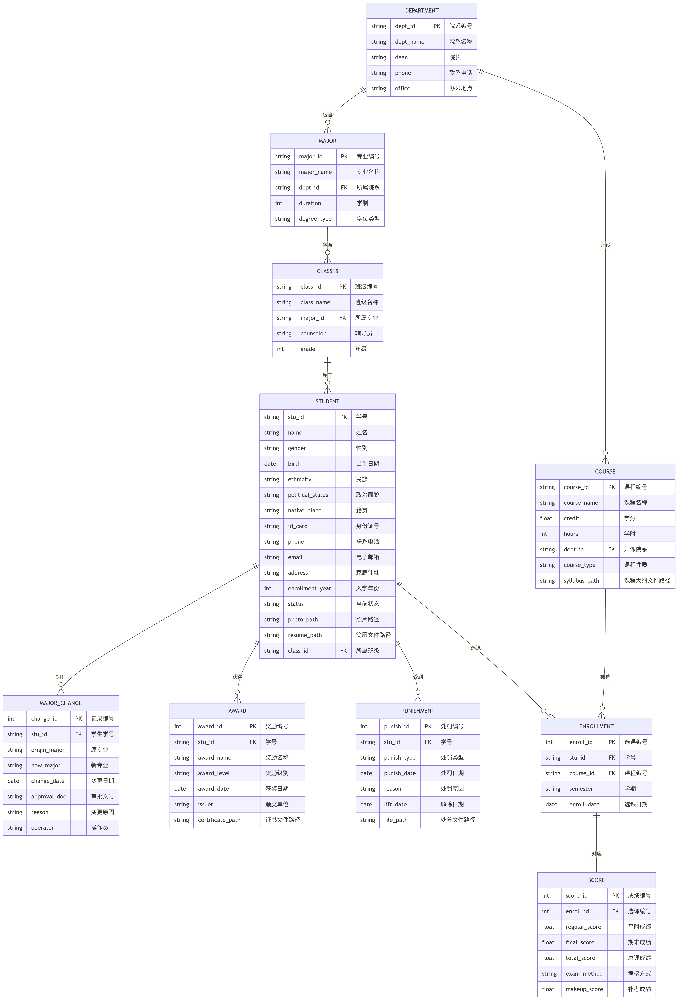

# 学籍管理系统数据库需求分析
## PB23111693 韩雨桐

## 一、需求分析

### 1. 功能需求

#### （1）学生基本信息管理
- 增、删、改、查学生基本信息：学号、姓名、性别、出生日期、民族、政治面貌、籍贯、身份证号、联系电话、电子邮箱、家庭住址、入学年份、当前状态等。
- 支持学生照片、身份证扫描件等图片文件的上传与查看。
- 支持学生简历、体检报告等 PDF/视频文件的上传与管理。

#### （2）专业变更管理
- 记录学生专业变更历史（原专业、新专业、变更日期、审批文号、变更原因）。
- 查询学生专业变更记录，支持按时间段、院系统计。

#### （3）奖惩情况管理
- 记录奖励信息（奖励名称、奖励级别、获奖日期、颁奖单位、证书文件）。
- 记录处罚信息（处罚类型、处罚日期、处罚原因、解除日期）。
- 支持奖惩证明材料的图片/文件上传。

#### （4）课程管理
- 维护课程信息（课程编号、课程名称、学分、学时、开课院系、课程性质）。
- 支持课程大纲、教学日历等文件上传。

#### （5）课程成绩管理
- 录入、修改、查询学生各科成绩。用户操作层面涉及学号、课程编号、成绩、学期、考核方式、补考成绩等信息。
- 成绩统计分析（平均分、绩点计算、排名）。
- 支持成绩单的生成与打印（导出 PDF）。

#### （6）用户与权限管理
- 系统用户分为三类：系统管理员、教师（教务员）、学生。
- 管理员拥有全部权限；教师可管理所授课程成绩、查看学生信息；学生只能查看本人信息与成绩。
- **说明**：本次数据库设计中未创建独立的 `USERS` 表，用户认证与授权全部在应用程序业务逻辑层实现（如通过配置文件、环境变量或临时用户表），保证数据库模式的纯业务性。

#### （7）图片/视频/文件管理
- 所有上传文件统一存储于服务器指定目录，数据库中保存文件相对路径。
- 支持文件类型过滤、大小限制、预览与下载。
- 文件与对应业务实体（学生、课程、奖惩等）关联，保证数据一致性（使用外键约束）。

#### （8）存储过程、函数、事务、触发器
- **存储过程**：批量导入学生成绩、计算学期平均绩点。
- **函数**：计算学生平均学分绩点（GPA）、判断学生是否达到毕业要求。
- **事务**：学生专业变更时同步更新学籍状态、记录变更日志，保证原子性。
- **触发器**：当成绩表发生变动时自动更新学生总学分、平均绩点等汇总字段；当奖惩记录发生变更时自动更新学生档案标记（如“曾受处分”状态）。

### 2. 数据需求
系统涉及的核心数据实体及其属性如下（其中每个实体的第一个属性是主码）：

- **院系（Department）**：院系编号、院系名称、院长、联系电话、办公地点
- **专业（Major）**：专业编号、专业名称、所属院系（FK）、学制、学位类型
- **班级（Class）**：班级编号、班级名称、所属专业（FK）、辅导员、年级
- **学生（Student）**：学号、姓名、性别、出生日期、民族、政治面貌、籍贯、身份证号、联系电话、电子邮箱、家庭住址、入学年份、当前状态、照片路径、简历文件路径、所属班级（FK）
- **专业变更记录（MajorChange）**：记录编号、学生学号（FK）、原专业、新专业、变更日期、审批文号、变更原因、操作员
- **奖励记录（Award）**：奖励编号、学号（FK）、奖励名称、奖励级别、获奖日期、颁奖单位、证书文件路径
- **处罚记录（Punishment）**：处罚编号、学号（FK）、处罚类型、处罚日期、处罚原因、解除日期、处分文件路径
- **课程（Course）**：课程编号、课程名称、学分、学时、开课院系（FK）、课程性质、课程大纲文件路径
- **选课（Enrollment）**：选课编号、学号（FK）、课程编号（FK）、学期、选课日期
- **成绩（Score）**：成绩编号、选课编号（FK）、平时成绩、期末成绩、总评成绩、考核方式、补考成绩

> **说明**：成绩实体不再直接存储学号和课程编号，而是通过选课编号与选课表进行 1:1 关联，避免数据冗余，符合 3NF。

---

## 二、概要设计 —— ER 图

### 1. 实体与属性（主键用下划线，外键用斜体）

> **说明**：实体命名为CLASS会导致mermaid渲染错误，故将CLASS实体的名称改为CLASSES。

| 实体 | 属性 |
|------|------|
| **DEPARTMENT** | <u>dept_id</u>, dept_name, dean, phone, office |
| **MAJOR** | <u>major_id</u>, major_name, *dept_id*, duration, degree_type |
| **CLASSES** | <u>class_id</u>, class_name, *major_id*, counselor, grade |
| **STUDENT** | <u>stu_id</u>, name, gender, birth, ethnicity, political_status, native_place, id_card, phone, email, address, enrollment_year, status, photo_path, resume_path, *class_id* |
| **MAJOR_CHANGE** | <u>change_id</u>, *stu_id*, origin_major, new_major, change_date, approval_doc, reason, operator |
| **AWARD** | <u>award_id</u>, *stu_id*, award_name, award_level, award_date, issuer, certificate_path |
| **PUNISHMENT** | <u>punish_id</u>, *stu_id*, punish_type, punish_date, reason, lift_date, file_path |
| **COURSE** | <u>course_id</u>, course_name, credit, hours, *dept_id*, course_type, syllabus_path |
| **ENROLLMENT** | <u>enroll_id</u>, *stu_id*, *course_id*, semester, enroll_date |
| **SCORE** | <u>score_id</u>, *enroll_id*, regular_score, final_score, total_score, exam_method, makeup_score |

### 2. 实体关系及基数

| 关系 | 基数 | 说明 |
|------|------|------|
| 院系 — 专业 | **1 : N** | 一个院系包含多个专业，一个专业只属于一个院系 |
| 专业 — 班级 | **1 : N** | 一个专业可设置多个班级，一个班级只属于一个专业 |
| 班级 — 学生 | **1 : N** | 一个班级拥有多名学生，一名学生只属于一个班级 |
| 学生 — 专业变更记录 | **1 : N** | 一名学生可有多次专业变更记录，每条记录对应一名学生 |
| 学生 — 奖励 | **1 : N** | 一名学生可获多项奖励，每项奖励只属于一名学生 |
| 学生 — 处罚 | **1 : N** | 一名学生可受多次处罚，每项处罚只针对一名学生 |
| 院系 — 课程 | **1 : N** | 一个院系开设多门课程，一门课程只由一个院系开设 |
| 学生 — 选课 | **1 : N** | 一名学生可以有多条选课记录，每条选课记录对应一名学生 |
| 课程 — 选课 | **1 : N** | 一门课程可以被多名学生选修，每条选课记录对应一门课程 |
| 选课 — 成绩 | **1 : 1** | 每条选课记录均有一条成绩记录 |

ER图见文档末尾。

---

## 三、数据库模式满足 3NF 的论证

所有表均满足第三范式（3NF）：

- **每个表都有原子值，且主键决定所有非主属性**，不存在部分依赖。
- **无传递依赖**：任何非主属性只直接依赖于主键，不依赖于其他非主属性。例如 `STUDENT` 表中的 `class_id` 是外键，它引用 `CLASSES` 表，但 `STUDENT` 表内部并没有“学号 → 班级编号 → 辅导员”这样的依赖链条，因为 `counselor` 属于 `CLASSES` 表，不属于 `STUDENT` 表。
- **SCORE 与 ENROLLMENT 的 1:1 设计**：成绩属性完全依赖于 `score_id`（或 `enroll_id`），即使将 `enroll_id` 作为主键，也符合 3NF。
- 所有多对多联系已通过分解（ENROLLMENT 表）处理，消除冗余。

综上，该数据库设计消除了冗余传递依赖，保证了数据一致性和完整性，符合 3NF 要求。

---
#### ER图

注：Mermaid代码制图，与课件上的ER图格式无法兼容，因此将属性列在实体下的表格内，联系写在连线上。除了ENROLLMENT和SCORE是1：1，其余都是1：N的关系。
此外由于图片长度过大，在pdf文件中可能出现一页显示不全的情况，因此提交的压缩包中包含了.png格式的ER图原图以及本文档的.md格式文档，请根据需要选择查看。
